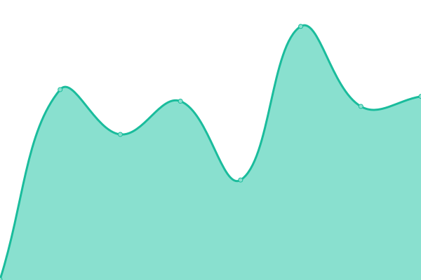

# [📈 Live Status](https://bac.github.io/upptime): <!--live status--> **🟩 All systems operational**

This repository contains the open-source uptime monitor and status page for [Brad Crittenden](bradcrittenden.net), powered by [Upptime](https://github.com/upptime/upptime).

With [Upptime](https://upptime.js.org), you can get your own unlimited and free uptime monitor and status page, powered entirely by a GitHub repository. We use [Issues](https://github.com/bac/upptime/issues) as incident reports, [Actions](https://github.com/bac/upptime/actions) as uptime monitors, and [Pages](https://bac.github.io/upptime) for the status page.

<!--start: status pages-->
<!-- This summary is generated by Upptime (https://github.com/upptime/upptime) -->
<!-- Do not edit this manually, your changes will be overwritten -->
<!-- prettier-ignore -->
| URL | Status | History | Response Time | Uptime |
| --- | ------ | ------- | ------------- | ------ |
|  [Nom Foundation web site](https://nomfoundation.org/About-the-Foundation/About-the-VNPF) | 🟩 Up | [nom-foundation-web-site.yml](https://github.com/bac/upptime/commits/HEAD/history/nom-foundation-web-site.yml) | 

 452ms
     
 | 

<a href="https://bac.github.io/upptime/history/nom-foundation-web-site">100.00%</a>
    

|  [Nom Foundation library web app](https://lib.nomfoundation.org/collection/1/) | 🟩 Up | [nom-foundation-library-web-app.yml](https://github.com/bac/upptime/commits/HEAD/history/nom-foundation-library-web-app.yml) | 

 590ms
     
 | 

<a href="https://bac.github.io/upptime/history/nom-foundation-library-web-app">100.00%</a>
    

<!--end: status pages-->

[**Visit our status website →**](https://bac.github.io/upptime)

## 📄 License

- Powered by: [Upptime](https://github.com/upptime/upptime)
- Code: [MIT](./LICENSE) © [Anand Chowdhary](https://anandchowdhary.com), supported by [Pabio](https://pabio.com)
- Data in the `./history` directory: [Open Database License](https://opendatacommons.org/licenses/odbl/1-0/)
